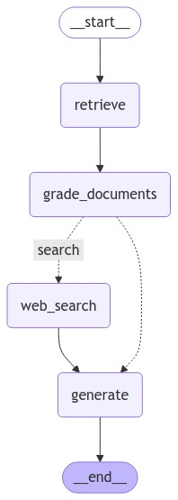

# **🌟 Fully Local RAG Agents with LLaMA 3.1 🌟**

### **Revolutionizing Retrieval-Augmented Generation (RAG) with a Local-First Approach**

Welcome to the future of AI-assisted knowledge retrieval! This repository showcases a hybrid **RAG (Retrieval-Augmented Generation)** system powered by **LLaMA 3.1**, offering an unparalleled combination of local data processing and optional web-based search.

---

## **📖 Overview**

This project implements a sophisticated workflow for answering user queries by:  
1️⃣ Searching **local documents** for relevant information.  
2️⃣ Falling back on **web search** when local data isn’t enough.  
3️⃣ Using the **LLaMA 3.1** model to generate concise and insightful answers.  

The system ensures **data privacy** while maintaining flexibility by integrating secure, local processing with web-enhanced intelligence.

---

## **✨ Key Features**

- **💾 Local Data First**: Process user-provided PDFs or URLs to create a custom knowledge base.  
- **🌐 Web Search Fallback**: Dynamically fetch answers from the web if local data is insufficient.  
- **🧠 Powered by LLaMA 3.1**: Generate human-like responses grounded in the retrieved context.  
- **⚡ Intelligent Retrieval**: Combines document splitting, embedding, and grading to ensure high-quality information retrieval.  
- **🛡️ Privacy Focused**: Local processing guarantees your data stays secure, with web search used only when necessary.  

---

## **🚦 How It Works**

### **1. Document Processing**  
Upload URLs or PDFs, which are processed as follows:  
- **Loading**: WebBaseLoader fetches online articles, or PDFs are converted to text.  
- **Splitting**: Text is split into smaller chunks using LangChain’s `RecursiveCharacterTextSplitter`.  
- **Embedding**: `Nomic-Embed-Text` embeddings transform text chunks into vector representations.  

### **2. Question Handling**  
When a query is submitted:  
- **Local Search**: The query is embedded and matched against the vector database for relevant text chunks.  
- **Grading**: A grader filters out irrelevant results, ensuring only the best information is used.  

### **3. Answer Generation**  
The relevant chunks are passed to **LLaMA 3.1**, which generates a concise and insightful response.

### **4. Web Search Fallback**  
If no local data is relevant, the system uses a web search tool (`TavilySearchResults`) to fetch additional context. These results are processed and added to the retrieved data for answer generation.

---

## **🔬 Workflow Diagram**

  
*An end-to-end pipeline combining local retrieval and web search fallback for comprehensive question answering.*

---

## **🎯 Use Cases**

- **Enterprises**: Securely process internal documents while integrating external knowledge when necessary.  
- **Researchers**: Combine custom datasets with real-time web resources for deep insights.  
- **AI Enthusiasts**: Experiment with advanced RAG systems combining local and web-based retrieval.  

---

## **📜 Theory Behind the Project**
- **Retrieval-Augmented Generation (RAG):**
  - Combines two paradigms:
    1. **Retrieval Models**: Efficiently search for relevant documents.
    2. **Generative Models**: Generate coherent and contextually rich answers.

- **LLaMA 3.1:**
  - A state-of-the-art language model designed for generative tasks.
  - Fine-tuned for local inference, reducing reliance on external APIs.

- **Vector Embeddings:**
  - Maps text into numerical vectors in a high-dimensional space.
  - Enables semantic searches based on content similarity.

---

## **🛠️ Tools and Technologies**

- **Language Model**: LLaMA 3.1  
- **Embedding Generator**: `nomic-embed-text-v1.5`  
- **Vector Storage**: SKLearn VectorStore  
- **Text Splitting**: LangChain’s RecursiveCharacterTextSplitter  
- **Web Search**: TavilySearchResults  
- **Programming Language**: Python  

---

## **🌟 What’s Next?**

This project is just the beginning! Planned future enhancements include:  
- **Multi-language Support**: Expand the system to handle non-English documents.  
- **OCR Integration**: Enable document ingestion from scanned images.  
- **Enhanced Grading**: Improve retrieval relevance with advanced scoring mechanisms.  
- **User Interface**: Build a web-based UI for seamless interaction.  

---

## **📖 References**

- [LangChain Documentation](https://langchain.com/)  
- [Ollama](https://ollama.com/)  
- [Nomic AI](https://nomic.ai/)  

---

## **🤝 Contributions**  
Contributions are welcome! If you have ideas or improvements, feel free to open an issue or submit a pull request.

---

## **📜 License**  
This project is licensed under the MIT License. See the [LICENSE](LICENSE) file for details.

--- 
